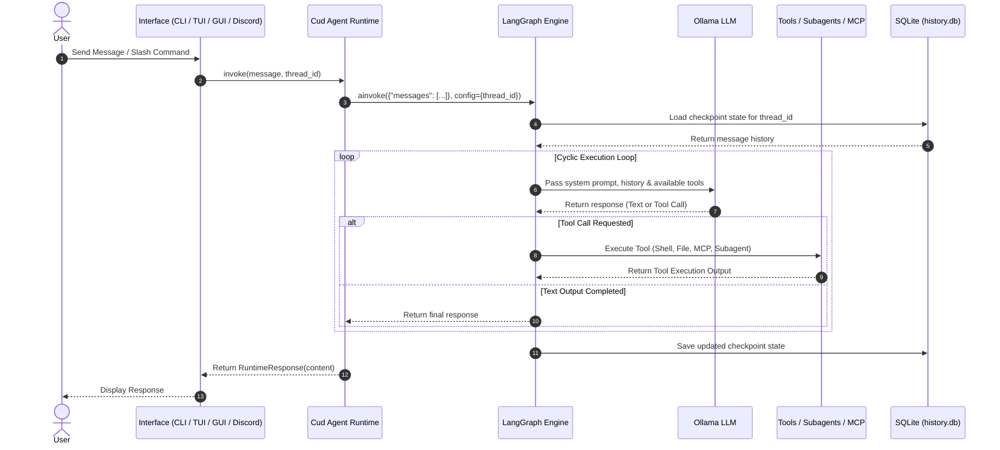

# System Architecture & Core Design

Cud is designed as a modular, local-first multi-agent runtime. It combines local LLM inference engines, stateful graph execution loops, persistent checkpointers, and extensible tool boundaries into a clean, predictable framework.

---

## 🏛️ High-Level Architectural Stack

```
┌────────────────────────────────────────────────────────────────────────┐
│                        User Interaction Layers                         │
│       Discord Gateway        │     Terminal TUI     │     PySide GUI   │
└───────────────────────────────────┬────────────────────────────────────┘
                                    │
                                    ▼
┌────────────────────────────────────────────────────────────────────────┐
│                         Cud Agent Runtime                              │
│  - System Prompt (AGENT.md)                      - Subagent Manager   │
│  - Settings (settings.yaml)                      - Composite Backend  │
│  - Async Exit Stack Lifecycle                    - MCP Tool Loader     │
└───────────────────────────────────┬────────────────────────────────────┘
                                    │
                                    ▼
┌────────────────────────────────────────────────────────────────────────┐
│                   DeepAgents / LangGraph State Engine                  │
│  - Cyclic Reasoning Loop                         - Context Middleware │
│  - Thread Isolation (thread_id)                  - SQLite Checkpointer│
└───────────────┬───────────────────┬───────────────────┬────────────────┘
                │                   │                   │
                ▼                   ▼                   ▼
┌───────────────────────┐ ┌───────────────────┐ ┌──────────────────────┐
│  Ollama LLM Engine    │ │  Tools & Backend  │ │  Subagents & MCP     │
│ (ChatOllama / Tool    │ │ (Bash, Filesystem,│ │ (Isolated Subagents, │
│  Calling capabilities)│ │  Memory, Skills)  │ │  stdio & SSE MCPs)   │
└───────────────────────┘ └───────────────────┘ └──────────────────────┘
```

---

## ⚡ Core Technical Components

### 1. Ollama LLM Inference Engine
Cud uses `ChatOllama` (from `langchain-ollama`) as its core model provider.
- **Local Autonomy**: All inference runs locally over Ollama's native REST API (`http://localhost:11434` by default).
- **Tool Calling Requirement**: Cud agents rely on structured tool calling to execute shell commands, edit files, query MCP servers, and delegate tasks to subagents. Models such as `gemma4:e4b`, `gpt-oss:20b`, or `qwen3.6:27b` are used.
- **Context Window Management**: Model parameters (`num_ctx`, `temperature`, `base_url`) are loaded directly from the agent's `settings.yaml` and passed during `ChatOllama` initialization.

### 2. DeepAgents Execution Loop
The agent reasoning core is powered by **[DeepAgents](https://docs.langchain.com/oss/python/deepagents/overview)** via `create_deep_agent(...)`:
- **Stateful Cycle**: Unlike basic single-turn chains, DeepAgents runs a cyclic execution loop (Plan → Act → Evaluate → Output).
- **Backend Routing**: A `CompositeBackend` routes filesystem and shell operations:
  - Default route: `LocalShellBackend` mapped to `~/.cud/agents/<name>/workspace/`.
  - Virtual route `/agent/`: `FilesystemBackend` mapped to `~/.cud/agents/<name>/` for reading system prompts, writing to `MEMORY.md`, and accessing skills.
- **Summarization Middleware**: `create_summarization_tool_middleware` monitors context consumption. When token counts approach model bounds, older turns are automatically summarized into `workspace/conversation_history/<thread_id>.md`.

### 3. LangGraph & SQLite Persistence
Conversation state and execution history are managed by **LangGraph**:
- **SQLite Checkpointing**: `AsyncSqliteSaver` persists the full graph state to `~/.cud/agents/<name>/history.db`.
- **Thread Isolation**: Every interaction (whether from a Discord thread, a TUI session, or a GUI tab) is tagged with a unique `thread_id`. State transitions, tool call outputs, and message histories are strictly isolated per thread.
- **State Reversion**: State history allows operations such as `undo_last_exchange`, which rolls back state to the previous human message without corrupting database integrity.

---

## 🔄 Interaction Loop & State Machine

The diagram below illustrates the end-to-end execution lifecycle of a user request in Cud:



---

## 🎯 System Prompt Composition

When an `AgentRuntime` starts or reloads, it builds the complete system prompt dynamically by combining:

1. **`AGENT.md` System Prompt**: The core instruction set, persona definitions, constraints, and custom operational directives written in Markdown.
2. **Long-Term Memory Injection**: The path `/agent/MEMORY.md` is exposed to the agent backend, allowing the agent to dynamically read and update its persistent memory across sessions.
3. **Skills Integration**: Markdown skill packages located in `/agent/workspace/skills/` are scanned and loaded into the tool environment.
4. **MCP & Subagent Tools**: Registered Model Context Protocol (MCP) tool schemas and custom subagents are appended to the model's function signature pool.
