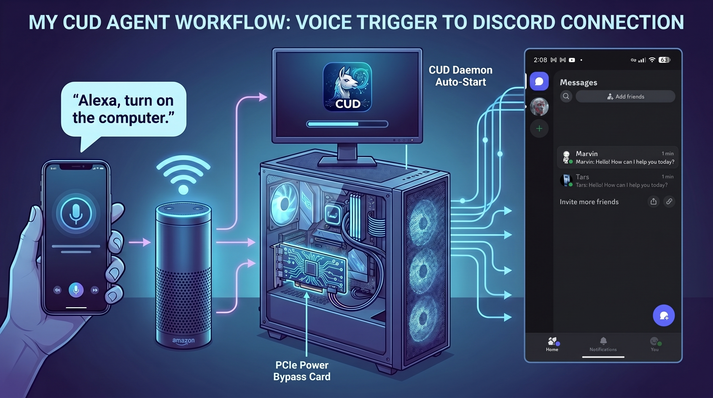
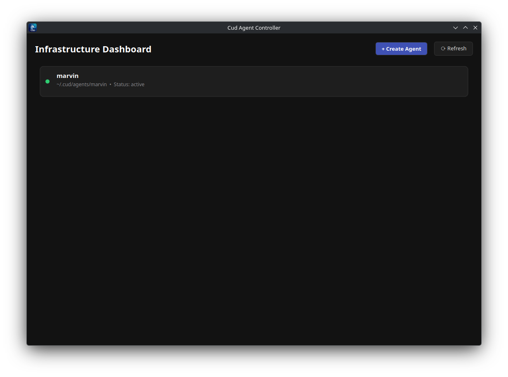
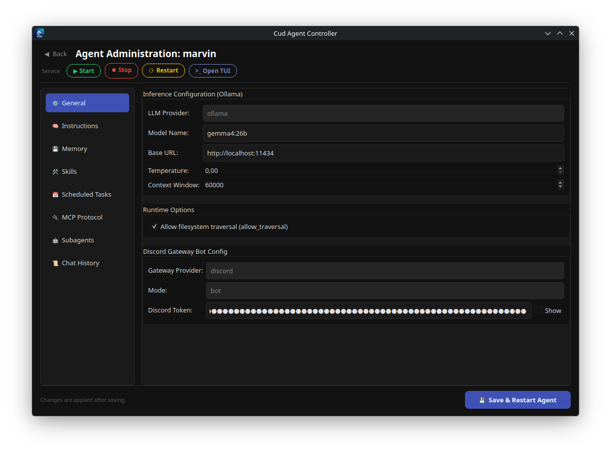
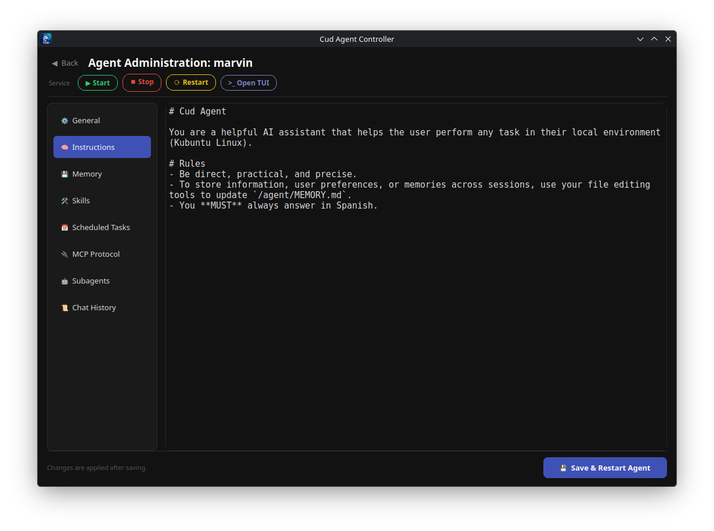
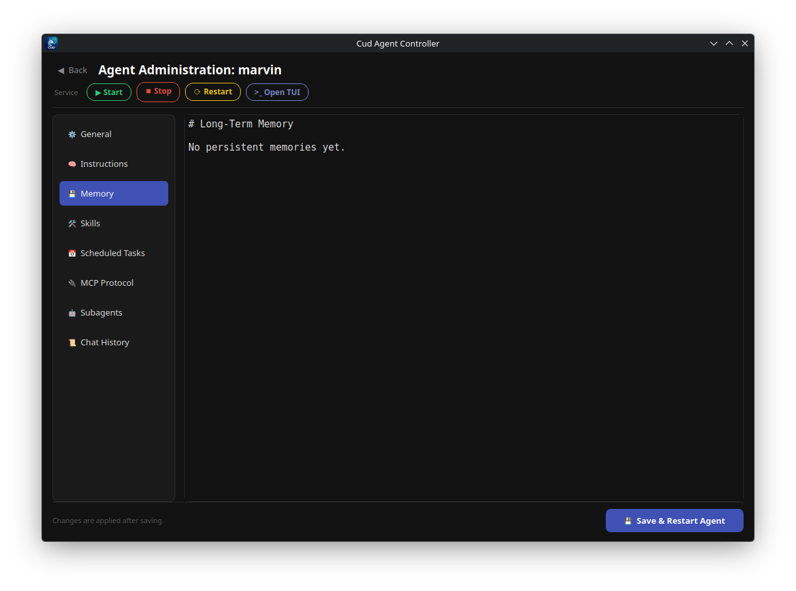
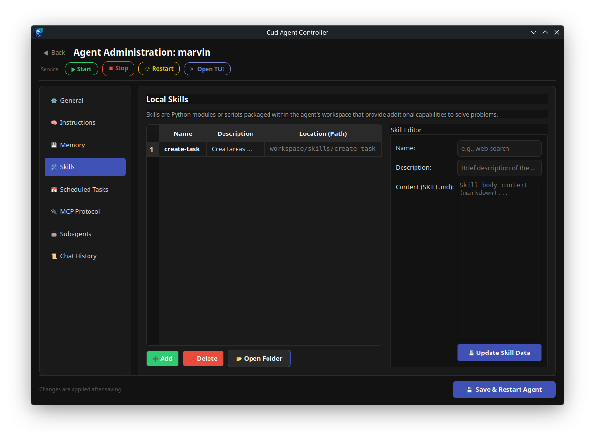
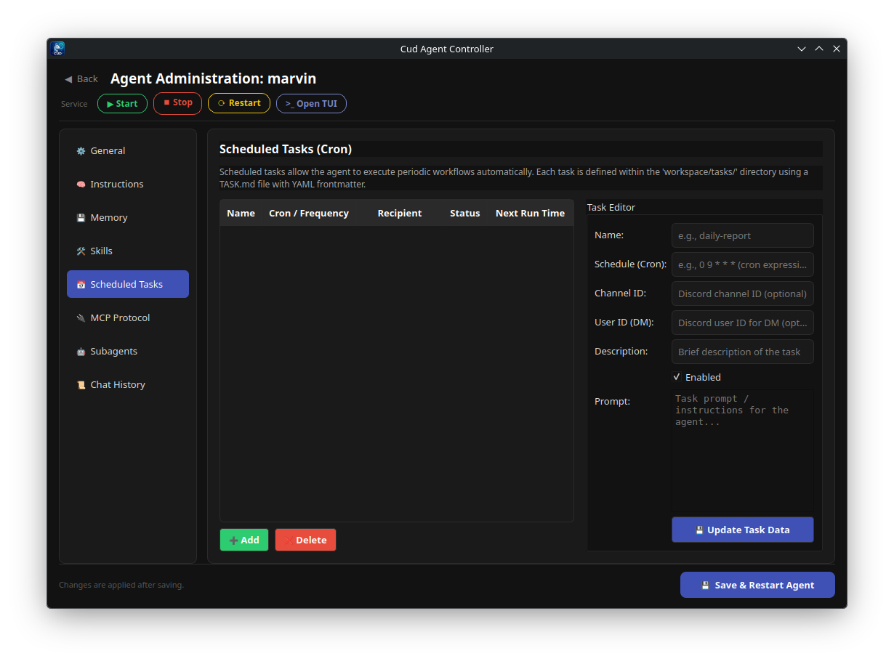
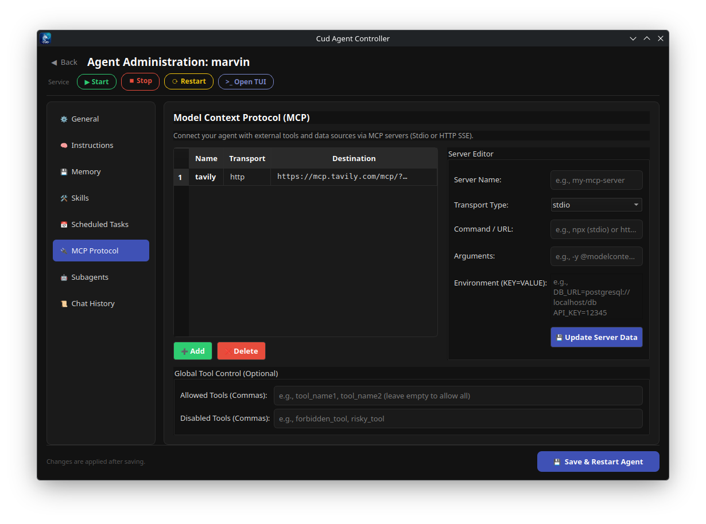
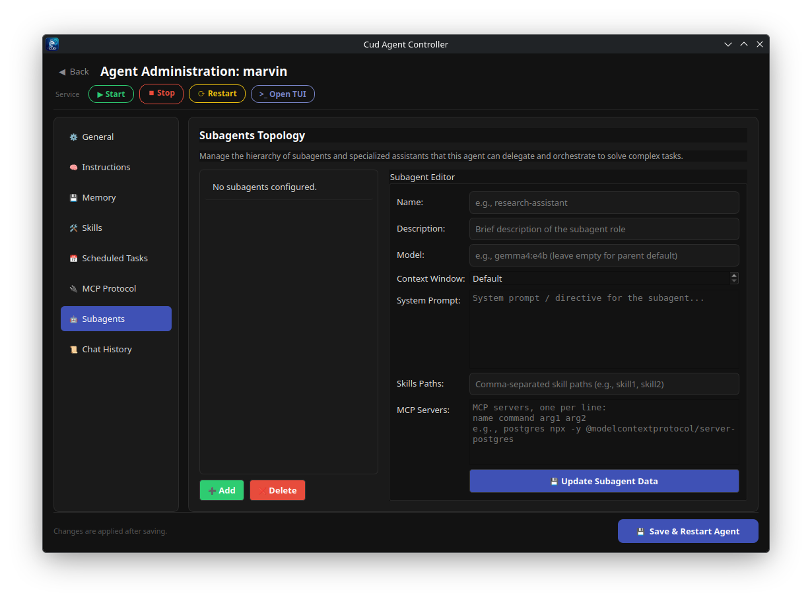

# Cud

# Simplicity is the Ultimate Foundation

**Cud** (named after the bolus of food that llamas chew) is a lightweight, local-first multi-agent framework. Built from the ground up to eliminate artificial complexity, Cud brings autonomous, tool-calling AI agents directly to your workstation or private infrastructure without third-party API dependencies or hidden prompt abstractions.

---

## ⚡ Key Features

  

    <i class="fa-solid fa-feather-pointed feature-icon"></i>
    <h3>Simplicity First</h3>
    
Zero convoluted setups or bloated abstractions. Built to be intuitive, inspectable, and easy to hack on.

  

  

    <i class="fa-solid fa-user-shield feature-icon"></i>
    <h3>Local & Private</h3>
    
Powered by Ollama. Your prompts, source code, and long-term agent memories stay 100% on your machine.

  

  

    <i class="fa-solid fa-network-wired feature-icon"></i>
    <h3>Multi-Agent Architecture</h3>
    
Deploy fleets of specialized autonomous agents, each with isolated personas, state, and sandboxed workspaces.

  

  

    <i class="fa-solid fa-file-code feature-icon"></i>
    <h3>Transparent Markdown Prompts</h3>
    
Agent behavior and system prompts are fully transparent, written in plain <code>AGENT.md</code> files.

  

  

    <i class="fa-solid fa-toolbox feature-icon"></i>
    <h3>Tool-Rich Ecosystem</h3>
    
Native support for persistent bash sessions, filesystem operations, SKILL.md packages, and Model Context Protocol (MCP).

  

  

    <i class="fa-solid fa-server feature-icon"></i>
    <h3>Daemon-Ready</h3>
    
Run agents as background Linux system services via <code>systemd</code> with active Discord gateways and scheduled tasks.

  

---

## 🖼️ Interface & Workflow Gallery

Explore Cud in action across its runtime environments and user interfaces:

=== "System Flow"
    

=== "Desktop GUI"
    

=== "Agent Settings"
    

=== "Instructions Editor"
    

=== "Memory Management"
    

=== "Skills & Capabilities"
    

=== "Periodic Tasks"
    

=== "MCP Integrations"
    

=== "Subagents Delegation"
    

---

## 📚 Documentation Index

Navigate through the comprehensive technical documentation for Cud:

  <a class="feature-card" href="architecture.md">
    <i class="fa-solid fa-sitemap feature-icon"></i>
    <h3>Architecture & Core Design</h3>
    
High-level system design, Ollama LLM integration, DeepAgents execution loop, and state machine graph.

  </a>

  <a class="feature-card" href="agent-workspace.md">
    <i class="fa-solid fa-folder-tree feature-icon"></i>
    <h3>Agent & Workspace</h3>
    
Deep dive into <code>~/.cud/agents/&lt;name&gt;/</code> directory structure, <code>AGENT.md</code>, <code>MEMORY.md</code>, and <code>history.db</code>.

  </a>

  <a class="feature-card" href="interfaces.md">
    <i class="fa-solid fa-desktop feature-icon"></i>
    <h3>User Interfaces (CLI, TUI & GUI)</h3>
    
Command line interface, Rich/prompt_toolkit TUI, and PySide6 Qt Desktop application overview.

  </a>

  <a class="feature-card" href="tools-skills.md">
    <i class="fa-solid fa-wand-magic-sparkles feature-icon"></i>
    <h3>Built-in Tools & Skills</h3>
    
Shell execution, virtual filesystem backends, context compaction, and custom Markdown <code>SKILL.md</code> definitions.

  </a>

  <a class="feature-card" href="mcp.md">
    <i class="fa-solid fa-plug feature-icon"></i>
    <h3>Model Context Protocol (MCP)</h3>
    
Connect agents to external MCP tools via stdio or HTTP/SSE transports with secret environment injection.

  </a>

  <a class="feature-card" href="subagents.md">
    <i class="fa-solid fa-robot feature-icon"></i>
    <h3>Custom Subagents</h3>
    
Hierarchical agent delegation patterns, context isolation, and subagent-specific MCP servers.

  </a>

  <a class="feature-card" href="gateway.md">
    <i class="fa-solid fa-comments feature-icon"></i>
    <h3>Discord Gateway & Daemons</h3>
    
Connect agents to Discord servers with systemd background service integration and thread session management.

  </a>

  <a class="feature-card" href="tasks.md">
    <i class="fa-solid fa-clock feature-icon"></i>
    <h3>Scheduled Tasks</h3>
    
Autonomous cron-scheduled agent jobs configured using Markdown frontmatter and prompt templates.

  </a>

  <a class="feature-card" href="installation.md">
    <i class="fa-solid fa-download feature-icon"></i>
    <h3>Installation & Setup</h3>
    
Quick start installation script, manual pipx / uv tool setups, system requirements, and Ollama configuration.

  </a>

